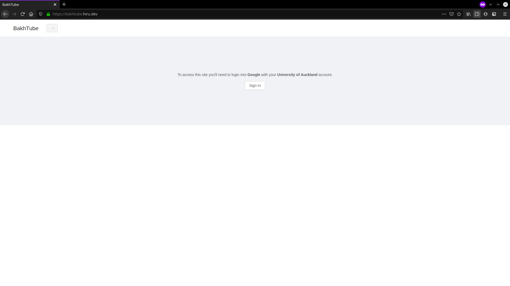
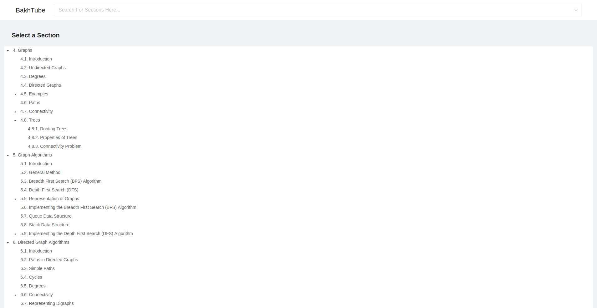
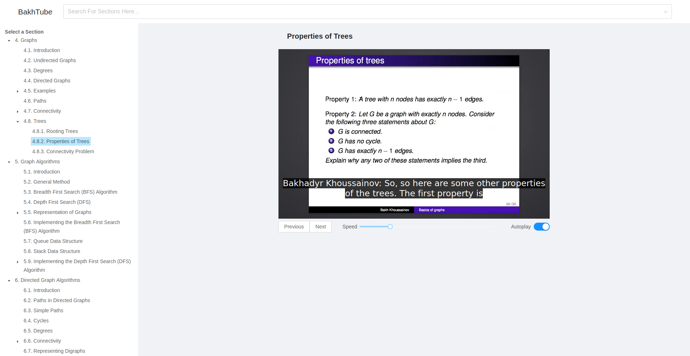

# Bakhtube

This is a small website I made to learn React
but also because during the Covid19 lockdown all my University courses went online.
Unfortunately some of the lecture recordings would have expired from the zoom cloud before the exams
so I decided to make a lecture viewing website that would host the expired videos.

This repo holds both the frontend, in React and Typescript, and the backend, in Python.
If you wish to setup this website then you need an AWS account
as the backend is hosted on Lambda and uses DynamoDB.
You would also need the [AWS SAM cli](https://aws.amazon.com/serverless/sam/)
as it is used to deploy the backend stack to AWS.

This also requires Google authentication (because all University of Auckland accounts have a Google account attached to them)
so you will need to register the account in the Google Developer Console.

Make sure to configure the `backend/template.yaml` file and `backend/functions/config.py`
to work with your specific AWS resources.

Disclaimer:
I wanted to finish this as soon as possible, as my exams were coming up,
so a lot of this was rushed, and the code quality is poor.

## Screenshots

### Login Page

### Select a Section

### Watching a Lecture

### Search for a Section

